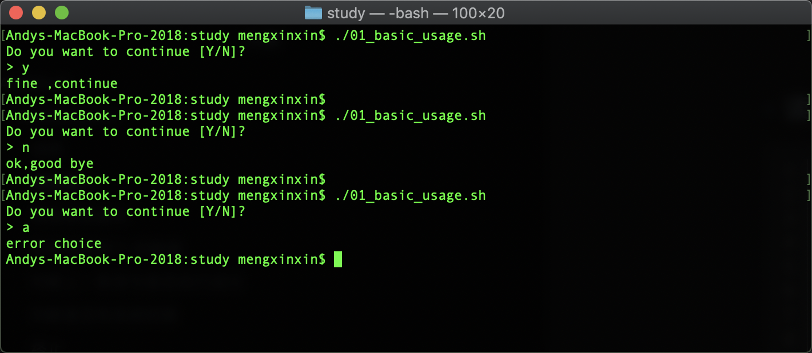
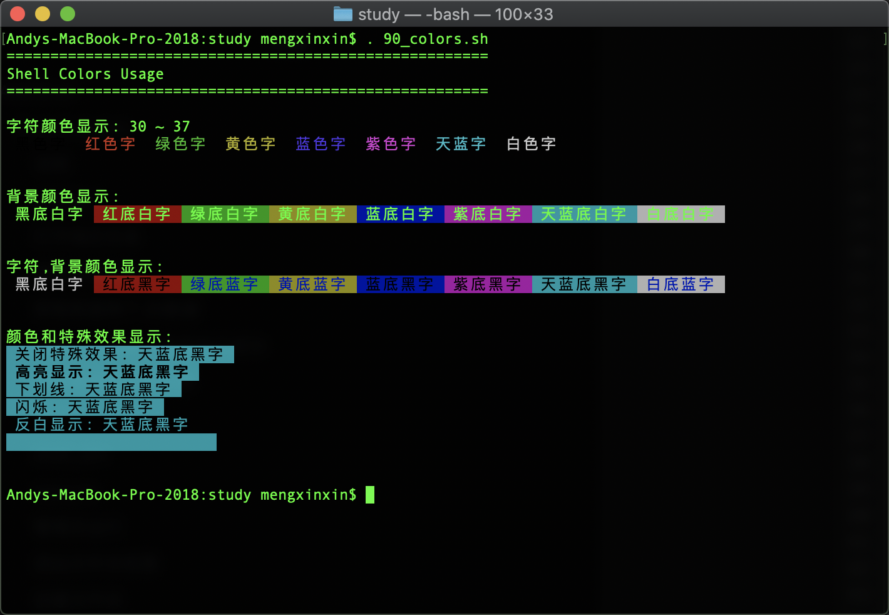

# AMKShell

## CodeSnippets

收集的各种通用的 Shell 命令/代码片段。

### 说明

```sh
echo -e "
              \033[1;32m开始执行 ${0##*/} 程序\033[0m
                  \033[1;36m[andy_m129@163.com]\033[0m
           [$(date "+%Y-%m-%d %H:%M:%S")][MacOS $(/usr/bin/sw_vers -productVersion)]
              \033[1;36m https://github.com/andyM129 \033[0m
"
```


### 读取输入

```shell
echo -e "Do you want to continue [Y/N]?"
read -n1 -p "> " answer
case $answer in
Y | y)
      echo -e "\nfine ,continue";;
N | n)
      echo -e "\nok,good bye";;
*)
      echo -e "\nerror choice";;
esac
```




### 打开指定目录

```shell
open /usr/local/
```


### 获取系统版本

```shell
#获取系统版本
macos_version="$(major_minor "$(/usr/bin/sw_vers -productVersion)")"
```


### 获取前面两个.的数据

```shell
#获取前面两个.的数据
major_minor() {
  echo "${1%%.*}.$(x="${1#*.}"; echo "${x%%.*}")"
}
```


### 判断上一条命令是否执行成功

```shell
# 判断上一条命令是否执行成功
JudgeSuccess() {
    if [ $? -ne 0 ];then
        echo '\033[1;31m此步骤失败 '$1'\033[0m'
        if [[ "$2" == 'out' ]]; then
          exit 0
        fi
    else
        echo "\033[1;32m此步骤成功\033[0m"
    fi
}
```

例如：

```shell
JudgeSuccess 尝试再次运行自动脚本选择其他下载源或者切换网络 out
```

或是：

```shell
brew -v

if [ $? -ne 0 ];then
    echo -e '
    \033[1;31m失败 查看下面文章第二部分的常见错误
    https://zhuanlan.zhihu.com/p/111014448
    如果没有解决，把运行脚本过程截图发到 cunkai.wang@foxmail.com --end
    \033[0m'
    exit 0
else
    echo -e "\033[1;32mBrew前期配置成功\033[0m"
fi
```


### 判断是否有系统权限

```shell
# 判断是否有系统权限
have_sudo_access() {
  if [[ -z "${HAVE_SUDO_ACCESS-}" ]]; then
    /usr/bin/sudo -l mkdir &>/dev/null
    HAVE_SUDO_ACCESS="$?"
  fi

  if [[ "$HAVE_SUDO_ACCESS" -ne 0 ]]; then
    echo "\033[1;31m开机密码输入错误，获取权限失败!\033[0m"
  fi

  return "$HAVE_SUDO_ACCESS"
}
```


### 终止

```shell
abort() {
  printf "%s\n" "$1"
  exit 1
}
```


### shell_join

```shell
shell_join() {
  local arg
  printf "%s" "$1"
  shift
  for arg in "$@"; do
    printf " "
    printf "%s" "${arg// /\ }"
  done
}
```


### execute

```shell
execute() {
  if ! "$@"; then
    abort "$(printf "\033[1;31m此命令运行失败（再次运行脚本或者手动运行此命令测试权限）:sudo %s\033[0m" "$(shell_join "$@")")"
  fi
}

```


### 管理员运行

```shell
# 管理员运行
execute_sudo() {
  # local -a args=("$@")
  # if [[ -n "${SUDO_ASKPASS-}" ]]; then
  #   args=("-A" "${args[@]}")
  # fi
  if have_sudo_access; then
    execute "/usr/bin/sudo" "$@"
  else
    execute "sudo" "$@"
  fi
}
```


### 添加文件夹权限

```shell
# 添加文件夹权限
AddPermission() {
  execute_sudo "/bin/chmod" "-R" "a+rwx" "$1"
  execute_sudo "$CHOWN" "$USER" "$1"
  execute_sudo "$CHGRP" "$GROUP" "$1"
}
```


### 创建文件夹

```shell
# 创建文件夹
CreateFolder() {
    echo '-> 创建文件夹' $1
    execute_sudo "/bin/mkdir" "-p" "$1"
    JudgeSuccess
    AddPermission $1
}

# 删除后重建
RmCreate() {
    sudo rm -rf $1
    CreateFolder $1
}
```


### 版本比较

```shell
# version_gt 判断$1是否大于$2
version_gt() {
  [[ "${1%.*}" -gt "${2%.*}" ]] || [[ "${1%.*}" -eq "${2%.*}" && "${1#*.}" -gt "${2#*.}" ]]
}

# version_ge 判断$1是否大于等于$2
version_ge() {
  [[ "${1%.*}" -gt "${2%.*}" ]] || [[ "${1%.*}" -eq "${2%.*}" && "${1#*.}" -ge "${2#*.}" ]]
}

# version_lt 判断$1是否小于$2
version_lt() {
  [[ "${1%.*}" -lt "${2%.*}" ]] || [[ "${1%.*}" -eq "${2%.*}" && "${1#*.}" -lt "${2#*.}" ]]
}
```

例如：

```shell
if version_gt "$macos_version" "10.14"; then
    echo "$macos_version"
else
    echo '\033[1;31m检测到你不是最新系统，会有一些报错，请稍等Ruby下载安装;\033[0m
    '
fi
```


### 标题

```shell
# 注释
echo 
```


### 标题

```shell
# 注释
echo 
```


### 标题

```shell
# 注释
echo 
```


### 标题

```shell
# 注释
echo 
```


### 标题

```shell
# 注释
echo 
```


### 标题

```shell
# 注释
echo 
```


### 标题

```shell
# 注释
echo 
```


## 颜色

```shell
#字符颜色显示
#-e:允许echo使用转义
#\033[:开始位
#\033[0m:结束位
#\033等同于\e
echo -e "\n字符颜色显示: 30 ~ 37"
echo -e -n "\033[30m 黑色字 \033[0m"  
echo -e -n "\033[31m 红色字 \033[0m"  
echo -e -n "\033[32m 绿色字 \033[0m"  
echo -e -n "\033[33m 黄色字 \033[0m"  
echo -e -n "\033[34m 蓝色字 \033[0m"  
echo -e -n "\033[35m 紫色字 \033[0m"  
echo -e -n "\033[36m 天蓝字 \033[0m"  
echo -e -n "\033[37m 白色字 \033[0m"  
echo -e "\n"


# 背景颜色范围:40-47  
echo -e "\n背景颜色显示:"
echo -e -n "\033[40m 黑底白字 \033[0m"  
echo -e -n "\033[41m 红底白字 \033[0m"  
echo -e -n "\033[42m 绿底白字 \033[0m"  
echo -e -n "\033[43m 黄底白字 \033[0m"  
echo -e -n "\033[44m 蓝底白字 \033[0m"  
echo -e -n "\033[45m 紫底白字 \033[0m"  
echo -e -n "\033[46m 天蓝底白字 \033[0m"  
echo -e -n "\033[47m 白底白字 \033[0m" 
echo -e "\n"


# 字符颜色与背景颜色用;号相隔
echo -e "\n字符,背景颜色显示:"
echo -e -n "\033[40;37m 黑底白字 \033[0m"  
echo -e -n "\033[41;30m 红底黑字 \033[0m"  
echo -e -n "\033[42;34m 绿底蓝字 \033[0m"  
echo -e -n "\033[43;34m 黄底蓝字 \033[0m"  
echo -e -n "\033[44;30m 蓝底黑字 \033[0m"  
echo -e -n "\033[45;30m 紫底黑字 \033[0m"  
echo -e -n "\033[46;30m 天蓝底黑字 \033[0m"  
echo -e -n "\033[47;34m 白底蓝字 \033[0m" 
echo -e "\n"


#0:关闭特殊效果
#1:高亮显示
#4:下划线
#5:闪烁
#7:反白显示
#8:隐藏不可见
#特殊效果和颜色用;号相隔,没有顺序
echo -e "\n颜色和特殊效果显示:"
echo -e "\033[0;46;30m 关闭特殊效果: 天蓝底黑字 \033[0m"  
echo -e "\033[1;46;30m 高亮显示: 天蓝底黑字 \033[0m"  
echo -e "\033[4;46;30m 下划线: 天蓝底黑字 \033[0m"  
echo -e "\033[5;46;30m 闪烁: 天蓝底黑字 \033[0m"  
echo -e "\033[7;46;30m 反白显示: 天蓝底黑字 \033[0m"  
echo -e "\033[8;46;30m 隐藏不可见: 天蓝底黑字 \033[0m"
echo -e "\n"

```



